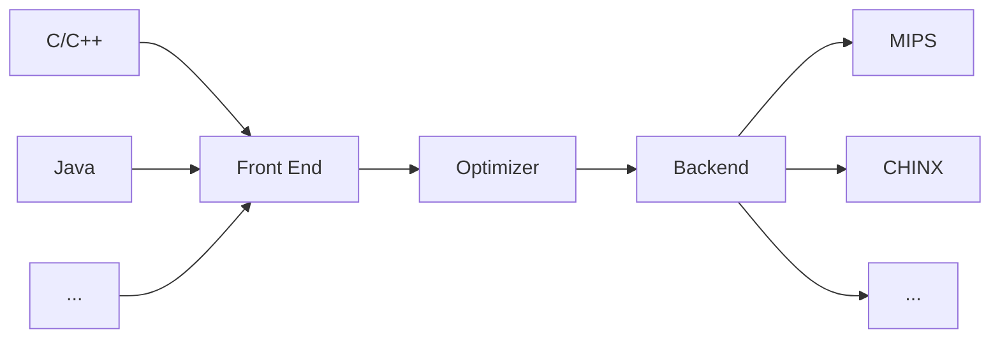

# Forward

This is a project about graduation thesis to design and build a custom 32-bit CPU named ``Chinx``, by using SystemVerilog HDL, with its backend design on LLVM. ``Chinx`` owns 32-bit data bus and 8-bit address bus, cause considering that there are not so many data or instructions needed to store, and 32-bit registers. The data storage only supports aligned ``load`` and ``store`` operations. Especially, the storage model uses Harvard architecture. 

In this project, I will emphasize on how to build the LLVM backend to support ``Chinx``, and to design and implementation the micro-architecture of ``Chinx``. 

## chinx

Include all systemverilog sources files about constructing a SoC and simulation files on it.

## backend

Include all documents about how to transfer the custom ISA on LLVM backend.

## pics

Include all description pictures used in markdown files.

## tools

**If your development is built on Linux system**

Download source codes with llvm development tools from ``http://llvm.org/releases/download.html`` and compile manually.
1. llvm-7.0.0.src.tar.xz ``e.g. wget http://releases.llvm.org/7.0.0/llvm-7.0.0.src.tar.xz``
2. options
   1. cfe-7.0.0.src.tar.xz
   2. compiler-rt-7.0.0.src.tar.xz
   3. if you want to build *clang* as the front-end of llvm, untar **cfe-7.0.0.src.tar.xz**  and rename it as **clang**, then move it to **tools**, the subdirectory of the source codes root.
   4. untar **compiler-rt-7.0.0.src.tar.xz** and rename it as **compiler-rt**, then move it to **project**, the subdirectory of the source codes root.
3. use ``cmake``, like the normally steps of building, with ``configure ``, ``cmake ../`` and ``cmake --build .`` in the building directory. Detailed description referred to https://llvm.org/docs.

**If your development is built on Windows system**

1. Download the source codes from http://llvm.org/releases/download.html, like the operations on **Linux**.

2. To make the back-end porting and debug easily, download and install ``visual studio``.

   1. Create a **CMake** project at the root directory, and configure the **TARGET_TO_BUILD** parameter as **Chinx** to build a new backend to support ``Chinx``.

   2. The CMake configuration and build info is described in the **CMakeSettings.json**. Like this,

      ```json
      {
        "configurations": [
          {
            "name": "x64-Debug",
            "generator": "Ninja",
            "configurationType": "Debug",
            "inheritEnvironments": [
              "msvc_x64_x64"
            ],
            "buildRoot": "$BUILDROOT",
            "installRoot": "$INSTALLROOT",
            "cmakeCommandArgs": "-DLLVM_TARGETS_TO_BUILD=Chinx",
            "buildCommandArgs": "",
            "ctestCommandArgs": ""
          }
        ]
      }
      ```

3. Download and install ``Vivado 2018.3`` and other ``Xilinx`` design tools, with ``ModelSim`` optionally.

# LLVM

Since the LLVM compilation tools support the techniques that by writing compiler backends to convert the LLVM Intermediate Representation``IR`` to code for a specified machine, this project would follow its [Document: 'Writing an LLVM Backend'](https://llvm.org/docs/WritingAnLLVMBackend.html#introduction) to convert the c language(subset of it) to assembly code fitted with Chinx.

## References

[[1]] Chen Chung-Shu.TutorialLLVMBackend,Release 3.9.1,2018,http://jonathan2251.github.io/lbd/<br>
[[2]] Writing an LLVM Backend,https://llvm.org/docs/WritingAnLLVMBackend.html<br>
[[3]] TableGen,http://llvm.org/docs/TableGen/index.html<br>
[[4]] The Design of a Custom 32-bit RISC CPU and LLVM Compiler Backend,http://scholarworks.rit.edu/thesis

[1]: http://jonathan2251.github.io/lbd/
[2]: https://llvm.org/docs/WritingAnLLVMBackend.html
[3]: http://llvm.org/docs/TableGen/index.html
[4]: http://scholarworks.rit.edu/thesis

## TableGen

*TableGen* files consist of two key types: *class* and *definitions*, both of which are considered *records*.<sup>[[3]]</sup><font size=4>``Records = Unique Name + List of Values + List of Superclasses``</font>


*TableGen definitions* are marked with the **def** keyword. For example, <font size=4>```def Obj : Base<"param1", "param2">;```</font> **Obj** is **Base** record initialised with values **param1** and **param2**. Especially, most target *TableGen* files include the generic ones in **"include//llvm//Target"**.

*TableGen classes* are abstract records that are used to build and describe other records. They are marked with the **class** keyword.


The power in *TableGen* is to interpret the source files into an internal representation that can be generated into anything you want.<sup>[[3]]</sup>

## Basic Steps

1. Create a subclass of the **TargetMachine** class that describes characteristics of my model machine. May copy and modify the existed example of **MIPS**, then start with **ChinxTargetMachine.cpp** and **ChinxTargetMachine.h**.
2. Describe the register set of the model machine. Use *TableGen* to generate code for register definition, register aliases, and register classes from the **ChinxRegisterInfo.td** input file. Besides, write additional code for a subclass of the **ChinxRegisterInfo** class that represents the class register file data used for register allocation and also describes the interactions between registers.
3. Describe the instruction set of Chinx. Use *TableGen* to generate code for target-specific instructions from target-specific versions of **ChinxInstrFormats.td** and **ChinxInstrInfo.td**. Besides, write additional code for a subclass of the **ChinxInstrInfo** class to represent machine instructions supported by the model machine.
4. Describe the selection and conversion of the *LLVM IR* from a Directed Acyclic Graph``DAG`` representation of instructions to Chinx instructions. Use *TableGen* to generate code that matches patterns and selects instructions based on additional information in **ChinxInstrInfo.td**. Besides, write code for **ChinxISelDAGToDAG.cpp** to perform pattern matching and DAG-to-DAG instruction selection. Also write code in **ChinxISelLowering.cpp** to replace or remove operations and data types that are not supported natively in a *SelectionDAG*.
5. Write code for an assembly printer that converts *LLVM IR* to a *GAS* format for the model machine. To do so, assembly strings to the instructions shuold be defined in **ChinxInstrInfo.td** and also write code for a subclass of *AsmPrinter* that performs the LLVM-to-assembly conversion and a trivial subclass of **ChinxAsmInfo**.

## Preliminaries

1. Create a subdirectory named ``Chinx`` under ``lib/Target`` to hold all the files related to the model machine, **Chinx** target.
2. Create a ``CMakeLists.txt`` in ``lib/Target/Chinx``, may easily copy and modify an existed file like the ``CMakeLists.txt`` of **MIPS**. It must also be noted that the ``CMakeLists.txt`` contains the ``LLVM_TARGET_DEFINITIONS`` variable.

## Registration

To register for ``Chinx`` and build a new compiler supports it, these modified files are the least requirements:

```cpp
src
--> cmake
    --- config-ix.cmake
--> include
    --> llvm
        --> ADT
            --- Triple.h
        --> Object
            --- ELFObjectFile.h
        --> BinaryFormat
            --- ELF.h
            --> ELFRelocs
                --- Chinx.def
--> lib
    --> MC
        --- MCSubtargetInfo.cpp
        --- SubtargetFeature.cpp
    --> Object
        --- ELF.cpp
    --> Support
        --- Triple.cpp
--- CMakeLists.txt
```

### src/cmake/config-ix.cmake

LLVM uses string to match the target machine, thus we need to add an identification ``chinx`` in the source code.

```cmake
elseif (LLVM_NATIVE_ARCH MATCHES "chinx")
	set(LLVM_NATIVE_ARCH Chinx)
```

### src/include/llvm/ADT/Triple.h

The unique enumeration **Triple::chinx** will identify ``Chinx`` as an unique target machine in the later design of LLVM backend.

```cpp
#undef chinx // avoid identification conflict
class Triple {
    public:
    enum ArchType {
        chinx
    }
}
```

### src/inclue/llvm/Object/ELFObjectFile.h

*ELFXXX.h* and *ELFXXX.cpp* are used to describe the ELF(Executable and Linkable Format) file generation.

```cpp
template <class ELFT> StringRef ELFOjectFile<ELFT>::getFileFormatName() const {
    switch (EF.getHeader()->e_ident[ELF::EI_CLASS]) {
        case ELF::ELFCLASS32:
            switch (EF.getHeader()->e_machine) {
                case ELF::EM_CHINX:
                    return "ELF32-chinx";
            }
    }
}
```

### src/include/llvm/BinaryFormats/ELF.h

Set the **e_flags** of program header table in the ``Chinx`` ELF file.

| ELF Header | Program Header Table | Segment 1 | Segment 2 | ... |

```cpp
enum {
    EM_CHINX = 404 // a new enumeration constant without ambiguity
}
// e_flags
enum : unsigned {
    // if you do not have the demand to specify this word
    // ignore it
    EF_CHINX_PIC = 0x00000002 // position independent code
}
enum {
    #include "ELFRelocs/Chinx.def"
}
```

### src/include/llvm/BinaryFormats/ELFRelocs/Chinx.def

Describe some info about relocation, used for generating ELF file.

```cmake
#ifndef ELF_RELOC
#error "ELF_RELOC must be defined"
#endif
ELF_RELOC(R_CHINX_NONE,                0)
ELF_RELOC(R_CHINX_32,                  2)
ELF_RELOC(R_CHINX_HI16,                5)
ELF_RELOC(R_CHINX_LO16,                6)
ELF_RELOC(R_CHINX_GPREL16,             7)
ELF_RELOC(R_CHINX_LITERAL,             8)
ELF_RELOC(R_CHINX_GOT16,               9)
ELF_RELOC(R_CHINX_PC16,               10)
ELF_RELOC(R_CHINX_CALL16,             11)
ELF_RELOC(R_CHINX_GPREL32,            12)
ELF_RELOC(R_CHINX_PC24,               13)
ELF_RELOC(R_CHINX_GOT_HI16,           22)
ELF_RELOC(R_CHINX_GOT_LO16,           23)
ELF_RELOC(R_CHINX_RELGOT,             36)
ELF_RELOC(R_CHINX_TLS_GD,             42)
ELF_RELOC(R_CHINX_TLS_LDM,            43)
ELF_RELOC(R_CHINX_TLS_DTPREL_HI16,    44)
ELF_RELOC(R_CHINX_TLS_DTPREL_LO16,    45)
ELF_RELOC(R_CHINX_TLS_GOTTPREL,       46)
ELF_RELOC(R_CHINX_TLS_TPREL32,        47)
ELF_RELOC(R_CHINX_TLS_TPREL_HI16,     49)
ELF_RELOC(R_CHINX_TLS_TPREL_LO16,     50)
ELF_RELOC(R_CHINX_GLOB_DAT,           51)
ELF_RELOC(R_CHINX_JUMP_SLOT,          127)
```

Actually, this ***.def** file will be replaced by definition of **enum**. The keyword **ELF_RELOC** is a macro as below

```cpp
#define ELF_RELOC(name, value) name = value,
```

Thus, if you do not need to specify such information in ELF files, ignore it.

### src/lib/Object/ELF.cpp

```cpp
StringRef llvm::object::getELFRelocationTypeName(uint32_t Machine, uin32_t Type) {
    switch (Machine) {
        case ELF::EM_CHINX:
            switch (Type){
                    #include "llvm/BinaryFormat/ELFRelocas/Chinx.def"
                default:
                    break;
            }
    }
}
```

### src/lib/Support/Triple.cpp

Define string of each unique target machine for all enumerations represented unique architecture. e.g.  Unique architecture``chinx`` identified by string ``"chinx"``, and this string will be matched in serval CMake files.

Clarify that the architecture of ``Chinx`` as 32-bit. All the codes added in the registration stage are aimed for providing some machine associated descriptions on ``Chinx``.

```cpp
StringRef Tripe::getArchTypeName(ArchType Kind) {
    switch (Kind){
        case chinx:
            return "chinx";
    }
}
StringRef Triple::getArchTypePrefix(ArchType Kind) {
    switch (Kind) {
        case chinx:
            return "chinx";
    }
}
Triple::ArchType Triple::getArchTypeForLLVMName(StringRef Name) {
    return StringSwitch<Triple::ArchType>(Name).Case("chinx", chinx);
}
static Triple::ArchType parseArch(StringRef ArchName) {
    auto AT = StringSwitch<Triple::ArchType>(ArchName).Case("chinx", Triple::chinx);
}
static Triple::ObjectFormatType getDefaultFormat(const Triple& T) {
    switch (T.getArch()) {
        case Triple::chinx:
            return Triple::ELF;
    }
}
static unsigned getArchPointerBitWidth(llvm::Triple::ArchType Arch) {
    switch (Arch) {
        case llvm::Triple::chinx:
            return 32;
    }
}
Triple Triple::get32BitArchVariant() const {
    switch (getArch()) {
        case Triple::chinx:
            // Already 32-bit.
            break;
    }
}
```

After modifications above, we have done the configuration of ELF support and some architecture descriptions on ``Chinx``, like that we clarify ``Chinx`` as a 32-bit machine and declare that to generate executable file as position independent code.

If you do not want to fail to compile C program for ``Chinx`` and see error messages of unrecognized of ``Chinx`` when run the modified compiler, you may try to add some codes to mask these messages as below.

### src/lib/MC/MCSubtargetInfo.cpp

```cpp
bool ChinxDisableUnrecognizedMessage = false;
void MCSubtargetInfo::InitMCProcessorInfo(StringRef CPU, StringRef FS) {
  if (TargetTriple.getArch() == llvm::Triple::chinx)
    ChinxDisableUnrecognizedMessage = true;
}
const MCSchedModel &MCSubtargetInfo::getSchedModelForCPU(StringRef CPU) const {
    if (TargetTriple.getArch() != llvm::Triple::chinx)
        errs() << "'" << CPU
               << "' is not a recognized processor for this target"
               << " (ignoring processor)\n";
}
```

### src/lib/MC/SubtargetFeature.cpp

```cpp
extern bool ChinxDisableUnrecognizedMessage;
void SubtargetFeatures::ToggleFeature(FeatureBitset &Bits, StringRef Feature, 
                                      ArrayRef<SubtargetFeatureKV> FeatureTable) {
    if (!ChinxDisableUnrecognizedMessage)
    errs() << "'" << Feature << "' is not a recognized feature for this target"
           << " (ignoring feature)\n";
}
void SubtargetFeatures::ApplyFeatureFlag(FeatureBitset &Bits, StringRef Feature,
                                         ArrayRef<SubtargetFeatureKV> FeatureTable) {
  if (!ChinxDisableUnrecognizedMessage)
	assert(hasFlag(Feature));
  if (!ChinxDisableUnrecognizedMessage)
    errs() << "'" << Feature << "' is not a recognized feature for this target"
           << " (ignoring feature)\n";
}
FeatureBitset SubtargetFeatures::getFeatureBits(StringRef CPU,
                                                ArrayRef<SubtargetFeatureKV> CPUTable,
                                                ArrayRef<SubtargetFeatureKV> FeatureTable) {
    if (!ChinxDisableUnrecognizedMessage)
        errs() << "'" << CPU << "' is not a recognized processor for this target"
               << " (ignoring processor)\n";
}
```

To make and build the new backend correctly, we need to modify some CMake and LLVMBuild files. Obviously, we need to add ``Chinx`` identifier in the CMakeList.txt at the source root.

### src/CMakeList.txt

```cmake
set(LLVM_ALL_TARGETS
Chinx
)
```

But if you would like to give the parameter **TARGETS_TO_BUILD=Chinx** manually every time running cmake, there is no need to add such description in the CMakeList.txt. I suggest that remove other targets in the CMakeList.txt except ``Chinx``, and ``Chinx`` will be the only default target to build.

### src/lib/Target/LLVMBuild.txt

```cmake
subdirectories = 
	Chinx
```

## Implementation

Only codes added for description on ``Chinx`` are not enough,  more implementation codes are needed.

Before starting the implementation, we need to understand the focus of the back-end porting.



Front-end would build **AST**(Abstract Syntax Tree) to represent the source code, and convert it as IR for the coming optimization. Usually, LLVM uses **CLang** as the front end to generate the **IR**(Intermediate Representation) code. After that, machine-independent optimization on IR is essential. The most important work of backend is to transfer the IR code to machine-dependent code, called assembly code or machine code. To write the backend, we will focus on **DAG**, the converted form of AST, and we will see that the lowering operation is aimed for conversion. Based on DAG, the backend will select instruction for each node in a basic block. After instruction selection, the backend would schedule instructions based on architecture info provided by the target machine. Then, serial passes like register allocation, prologue and epilogue insertion, peephole optimization and assembly printing will run in order.


## Files

This directory tree is modified by the reference [[4]], Guides I-12.

```cpp
--> lib/Target/Chinx/
    --- Chinx.h
    --- Chinx.td
    --- ChinxAsmPrinter.cpp
    --- ChinxCallingConv.td
    --- ChinxFrameLowering.cpp
    --- ChinxFrameLowering.h
    --- ChinxISelDAGToDAG.cpp
    --- ChinxISelLowring.cpp
    --- ChinxISelLowering.h
    --- ChinxInstrFormats.td
    --- ChinxInstrInfo.cpp
    --- ChinxInstrInfo.h
    --- ChinxInstrInfo.td
    --- ChinxMCInstLower.cpp
    --- ChinxMCInstLower.h
    --- ChinxMachineFunctionInfo.cpp
    --- ChinxMachineFunctionInfo.h
    --- ChinxRegisterInfo.cpp
    --- ChinxRegisterInfo.h
    --- ChinxSubtarget.cpp
    --- ChinxSubtarget.h
    --- ChinxTargetMachine.cpp
    --- ChinxTargetMachine.h
    --- CMakeLists.txt
------> InstPrinter/
        --- ChinxInstPrinter.cpp
        --- ChinxInstPrinter.h
        --- CMakeLists.txt
        --- LLVMBuild.txt
    --- LLVMBuild.txt
------> MCTargetDesc/
        --- ChinxAsmBackend.cpp
        --- ChinxMCAsmInfo.cpp
        --- ChinxMCAsmInfo.h
        --- ChinxMCTargetDesc.cpp
        --- ChinxMCTargerDesc.h
        --- CMakeLists.txt
        --- LLVMBuild.txt
------> TargetInfo/
        --- ChinxTargetInfo.cpp
        --- CMakeLists.txt
        --- LLVMBuild.txt
```

## Building

**Linux**

After untar the ``llvm-7.0.0.src.tar.xz``, rename the ``llvm-7.0.0.src`` directory as ``src`` and copy the untarred ``cfe-7.0.0.src.tar.xz`` directory, renamed as ``clang``, to ``src/tools``.

When these source files are already prepared, use ``cmake`` to build Makefiles and then build the clang and the llvm. You can run a bash like this,W

```bash
# in the directory where 'src' is
mkdir build
cd build
cmake -DCMAKE_BUILD_TYPE=Release -DCLANG_BUILD_EXAMPLES=ON -DLLVM_BUILD_EXAMPLES=ON -G "Unix Makefiles" ../src/
# -jn : n based on the number of processes on your computer
make -j4 -l4
```

After that, you can add ``build/bin`` to ``PATH``, then add all modified source files into ``src``, like ``src/CMakeLists.txt``, ``src/cmake/config-ix.cmake`` and so on. The rebuild the llvm by command ``cmake -DCMAKE_CXX_COMPILER=clang++ -DCMAKE_C_COMPILER=clang -DCAMEK_BUILD_TYPE=Release -DLLVM_TARGETS_TO_BUILD=Chinx -G "Unix Makefiles" ../src/`` and ``make -j4 -l4`` to get the llvm compiler supporting ``Chinx``.

**Windows**

If you use ``visual studio`` as the development tool, can easily create a **CMake** project and write the configuration file like this,

```cmake
{
  "configurations": [
    {
      "name": "x64-Debug",
      "generator": "Ninja",
      "configurationType": "Debug",
      "inheritEnvironments": [
        "msvc_x64_x64"
      ],
      "buildRoot": "$BUILDROOT",
      "installRoot": "$INSTALLROOT",
      "cmakeCommandArgs": "-DLLVM_TARGETS_TO_BUILD=Chinx",
      "buildCommandArgs": "",
      "ctestCommandArgs": ""
    }
  ]
}
```

then generate making and building.

## Compilation
We can use clang first transfer the ``*.c`` file to ``*.bc`` file, which described by LLVM IR, using command ``clang -target x86_64-pc-windows-msvc -c *.c -emit-llvm -o *.bc``. You can use ``llvm-dis`` tools to check the ``*.bc`` file by command ``llvm-dis *.bc -o -``. Finally, run command ``llc -march=chinx -relocation-model=pic -filetype=asm *.bc -o *.s`` and you will get the assembly description of ``*.cpp`` on the model machine which used the processor ``Chinx``.

# Instructions

## references 

[[4]MIPS@32 ISA,MIPS32 Instruction Set Quick Reference v1.01](https://www.mips.com/products/architectures/mips32-2/)

## selections


# Micro-Architecture Design

## develops

**tool**   ``Vivado 2018.3``

**lang**   ``Verilog HDL``

## design

Based on MIPS32 ISA, may choose 5-segments pipeline as the center of the design.

# Outter Devices
