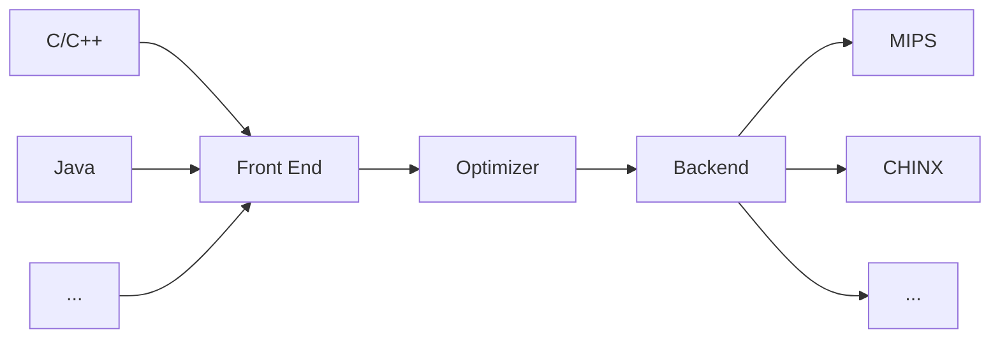
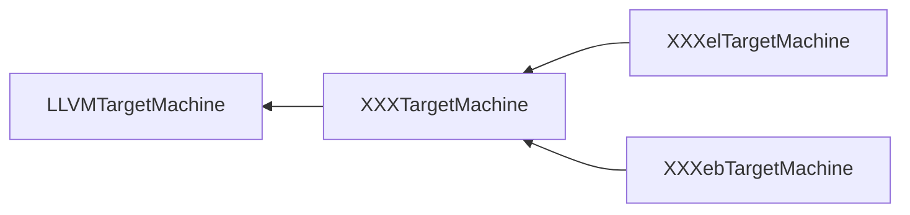
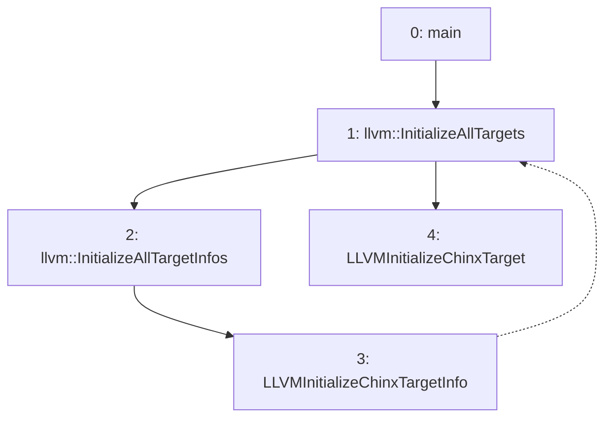
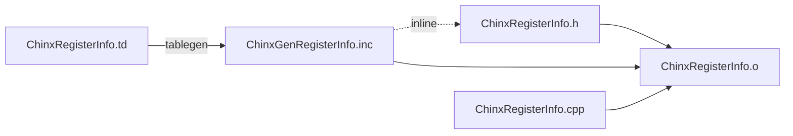
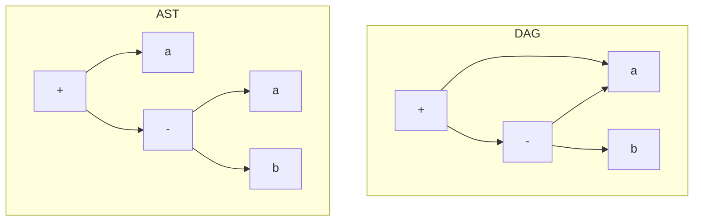
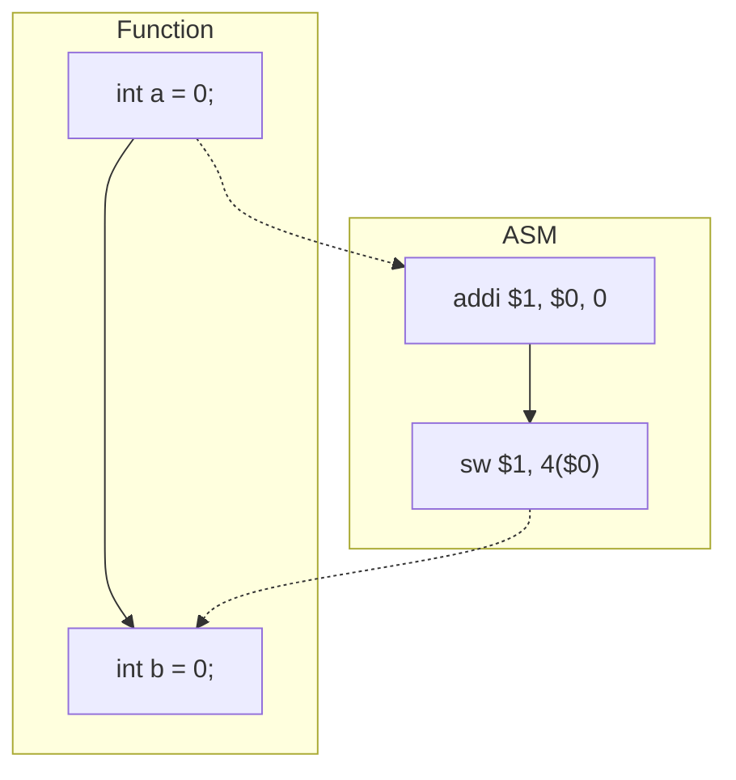

# Forward

This is a project about graduation thesis to design and build a custom 32-bit CPU named ``Chinx``, by using SystemVerilog HDL, with its backend design on LLVM. ``Chinx`` owns 32-bit data bus and 8-bit address bus, cause considering that there are not so many data or instructions needed to store, and 32-bit registers. The data storage only supports aligned ``load`` and ``store`` operations. Especially, the storage model uses Harvard architecture. 

In this project, I will emphasize on how to build the LLVM backend to support ``Chinx``, and to design and implementation the micro-architecture of ``Chinx``. 

## chinx

Include all systemverilog sources files about constructing a SoC and simulation files on it.

## backend

Include all documents about how to transfer the custom ISA on LLVM backend.

## pics

Include all description pictures used in markdown files.

## tools

**If your development is built on Linux system**

Download source codes with llvm development tools from ``http://llvm.org/releases/download.html`` and compile manually.
1. llvm-7.0.0.src.tar.xz ``e.g. wget http://releases.llvm.org/7.0.0/llvm-7.0.0.src.tar.xz``
2. options
   1. cfe-7.0.0.src.tar.xz
   2. compiler-rt-7.0.0.src.tar.xz
   3. if you want to build *clang* as the front-end of llvm, untar **cfe-7.0.0.src.tar.xz**  and rename it as **clang**, then move it to **tools**, the subdirectory of the source codes root.
   4. untar **compiler-rt-7.0.0.src.tar.xz** and rename it as **compiler-rt**, then move it to **project**, the subdirectory of the source codes root.
3. use ``cmake``, like the normally steps of building, with ``configure ``, ``cmake ../`` and ``cmake --build .`` in the building directory. Detailed description referred to https://llvm.org/docs.

**If your development is built on Windows system**

1. Download the source codes from http://llvm.org/releases/download.html, like the operations on **Linux**.

2. To make the back-end porting and debug easily, download and install ``visual studio``.

   1. Create a **CMake** project at the root directory, and configure the **TARGET_TO_BUILD** parameter as **Chinx** to build a new backend to support ``Chinx``.

   2. The CMake configuration and build info is described in the **CMakeSettings.json**. Like this,

      ```json
      {
        "configurations": [
          {
            "name": "x64-Debug",
            "generator": "Ninja",
            "configurationType": "Debug",
            "inheritEnvironments": [
              "msvc_x64_x64"
            ],
            "buildRoot": "$BUILDROOT",
            "installRoot": "$INSTALLROOT",
            "cmakeCommandArgs": "-DLLVM_TARGETS_TO_BUILD=Chinx",
            "buildCommandArgs": "",
            "ctestCommandArgs": ""
          }
        ]
      }
      ```

3. Download and install ``Vivado 2018.3`` and other ``Xilinx`` design tools, with ``ModelSim`` optionally.

# LLVM

Since the LLVM compilation tools support the techniques that by writing compiler backends to convert the LLVM Intermediate Representation``IR`` to code for a specified machine, this project would follow its [Document: 'Writing an LLVM Backend'](https://llvm.org/docs/WritingAnLLVMBackend.html#introduction) to convert the c language(subset of it) to assembly code fitted with Chinx.

## References

[[1]] Chen Chung-Shu.TutorialLLVMBackend,Release 3.9.1,2018,http://jonathan2251.github.io/lbd/<br>
[[2]] Writing an LLVM Backend,https://llvm.org/docs/WritingAnLLVMBackend.html<br>
[[3]] TableGen,http://llvm.org/docs/TableGen/index.html<br>
[[4]] The Design of a Custom 32-bit RISC CPU and LLVM Compiler Backend,http://scholarworks.rit.edu/thesis

[1]: http://jonathan2251.github.io/lbd/
[2]: https://llvm.org/docs/WritingAnLLVMBackend.html
[3]: http://llvm.org/docs/TableGen/index.html
[4]: http://scholarworks.rit.edu/thesis

## TableGen

*TableGen* files consist of two key types: *class* and *definitions*, both of which are considered *records*.<sup>[[3]]</sup><font size=4>``Records = Unique Name + List of Values + List of Superclasses``</font>


*TableGen definitions* are marked with the **def** keyword. For example, <font size=4>```def Obj : Base<"param1", "param2">;```</font> **Obj** is **Base** record initialised with values **param1** and **param2**. Especially, most target *TableGen* files include the generic ones in **"include//llvm//Target"**.

*TableGen classes* are abstract records that are used to build and describe other records. They are marked with the **class** keyword.


The power in *TableGen* is to interpret the source files into an internal representation that can be generated into anything you want.<sup>[[3]]</sup>

## Basic Steps

1. Create a subclass of the **TargetMachine** class that describes characteristics of my model machine. May copy and modify the existed example of **MIPS**, then start with **ChinxTargetMachine.cpp** and **ChinxTargetMachine.h**.
2. Describe the register set of the model machine. Use *TableGen* to generate code for register definition, register aliases, and register classes from the **ChinxRegisterInfo.td** input file. Besides, write additional code for a subclass of the **ChinxRegisterInfo** class that represents the class register file data used for register allocation and also describes the interactions between registers.
3. Describe the instruction set of Chinx. Use *TableGen* to generate code for target-specific instructions from target-specific versions of **ChinxInstrFormats.td** and **ChinxInstrInfo.td**. Besides, write additional code for a subclass of the **ChinxInstrInfo** class to represent machine instructions supported by the model machine.
4. Describe the selection and conversion of the *LLVM IR* from a Directed Acyclic Graph``DAG`` representation of instructions to Chinx instructions. Use *TableGen* to generate code that matches patterns and selects instructions based on additional information in **ChinxInstrInfo.td**. Besides, write code for **ChinxISelDAGToDAG.cpp** to perform pattern matching and DAG-to-DAG instruction selection. Also write code in **ChinxISelLowering.cpp** to replace or remove operations and data types that are not supported natively in a *SelectionDAG*.
5. Write code for an assembly printer that converts *LLVM IR* to a *GAS* format for the model machine. To do so, assembly strings to the instructions shuold be defined in **ChinxInstrInfo.td** and also write code for a subclass of *AsmPrinter* that performs the LLVM-to-assembly conversion and a trivial subclass of **ChinxAsmInfo**.

## Preliminaries

1. Create a subdirectory named ``Chinx`` under ``lib/Target`` to hold all the files related to the model machine, **Chinx** target.
2. Create a ``CMakeLists.txt`` in ``lib/Target/Chinx``, may easily copy and modify an existed file like the ``CMakeLists.txt`` of **MIPS**. It must also be noted that the ``CMakeLists.txt`` contains the ``LLVM_TARGET_DEFINITIONS`` variable.

## Registration

To register for ``Chinx`` and build a new compiler supports it, these modified files are the least requirements:

```cpp
src
--> cmake
    --- config-ix.cmake
--> include
    --> llvm
        --> ADT
            --- Triple.h
        --> Object
            --- ELFObjectFile.h
        --> BinaryFormat
            --- ELF.h
            --> ELFRelocs
                --- Chinx.def
--> lib
    --> MC
        --- MCSubtargetInfo.cpp
        --- SubtargetFeature.cpp
    --> Object
        --- ELF.cpp
    --> Support
        --- Triple.cpp
--- CMakeLists.txt
```

### src/cmake/config-ix.cmake

LLVM uses string to match the target machine, thus we need to add an identification ``chinx`` in the source code.

```cmake
elseif (LLVM_NATIVE_ARCH MATCHES "chinx")
	set(LLVM_NATIVE_ARCH Chinx)
```

### src/include/llvm/ADT/Triple.h

The unique enumeration **Triple::chinx** will identify ``Chinx`` as an unique target machine in the later design of LLVM backend.

```cpp
#undef chinx // avoid identification conflict
class Triple {
    public:
    enum ArchType {
        chinx
    }
}
```

### src/inclue/llvm/Object/ELFObjectFile.h

*ELFXXX.h* and *ELFXXX.cpp* are used to describe the ELF(Executable and Linkable Format) file generation.

```cpp
template <class ELFT> StringRef ELFOjectFile<ELFT>::getFileFormatName() const {
    switch (EF.getHeader()->e_ident[ELF::EI_CLASS]) {
        case ELF::ELFCLASS32:
            switch (EF.getHeader()->e_machine) {
                case ELF::EM_CHINX:
                    return "ELF32-chinx";
            }
    }
}
```

### src/include/llvm/BinaryFormats/ELF.h

Set the **e_flags** of program header table in the ``Chinx`` ELF file.

| ELF Header | Program Header Table | Segment 1 | Segment 2 | ... |

```cpp
enum {
    EM_CHINX = 404 // a new enumeration constant without ambiguity
}
// e_flags
enum : unsigned {
    // if you do not have the demand to specify this word
    // ignore it
    EF_CHINX_PIC = 0x00000002 // position independent code
}
enum {
    #include "ELFRelocs/Chinx.def"
}
```

### src/include/llvm/BinaryFormats/ELFRelocs/Chinx.def

Describe some info about relocation, used for generating ELF file.

```cmake
#ifndef ELF_RELOC
#error "ELF_RELOC must be defined"
#endif
ELF_RELOC(R_CHINX_NONE,                0)
ELF_RELOC(R_CHINX_32,                  2)
ELF_RELOC(R_CHINX_HI16,                5)
ELF_RELOC(R_CHINX_LO16,                6)
ELF_RELOC(R_CHINX_GPREL16,             7)
ELF_RELOC(R_CHINX_LITERAL,             8)
ELF_RELOC(R_CHINX_GOT16,               9)
ELF_RELOC(R_CHINX_PC16,               10)
ELF_RELOC(R_CHINX_CALL16,             11)
ELF_RELOC(R_CHINX_GPREL32,            12)
ELF_RELOC(R_CHINX_PC24,               13)
ELF_RELOC(R_CHINX_GOT_HI16,           22)
ELF_RELOC(R_CHINX_GOT_LO16,           23)
ELF_RELOC(R_CHINX_RELGOT,             36)
ELF_RELOC(R_CHINX_TLS_GD,             42)
ELF_RELOC(R_CHINX_TLS_LDM,            43)
ELF_RELOC(R_CHINX_TLS_DTPREL_HI16,    44)
ELF_RELOC(R_CHINX_TLS_DTPREL_LO16,    45)
ELF_RELOC(R_CHINX_TLS_GOTTPREL,       46)
ELF_RELOC(R_CHINX_TLS_TPREL32,        47)
ELF_RELOC(R_CHINX_TLS_TPREL_HI16,     49)
ELF_RELOC(R_CHINX_TLS_TPREL_LO16,     50)
ELF_RELOC(R_CHINX_GLOB_DAT,           51)
ELF_RELOC(R_CHINX_JUMP_SLOT,          127)
```

Actually, this ***.def** file will be replaced by definition of **enum**. The keyword **ELF_RELOC** is a macro as below

```cpp
#define ELF_RELOC(name, value) name = value,
```

Thus, if you do not need to specify such information in ELF files, ignore it.

### src/lib/Object/ELF.cpp

```cpp
StringRef llvm::object::getELFRelocationTypeName(uint32_t Machine, uin32_t Type) {
    switch (Machine) {
        case ELF::EM_CHINX:
            switch (Type){
                    #include "llvm/BinaryFormat/ELFRelocas/Chinx.def"
                default:
                    break;
            }
    }
}
```

### src/lib/Support/Triple.cpp

Define string of each unique target machine for all enumerations represented unique architecture. e.g.  Unique architecture``chinx`` identified by string ``"chinx"``, and this string will be matched in serval CMake files.

Clarify that the architecture of ``Chinx`` as 32-bit. All the codes added in the registration stage are aimed for providing some machine associated descriptions on ``Chinx``.

```cpp
StringRef Tripe::getArchTypeName(ArchType Kind) {
    switch (Kind){
        case chinx:
            return "chinx";
    }
}
StringRef Triple::getArchTypePrefix(ArchType Kind) {
    switch (Kind) {
        case chinx:
            return "chinx";
    }
}
Triple::ArchType Triple::getArchTypeForLLVMName(StringRef Name) {
    return StringSwitch<Triple::ArchType>(Name).Case("chinx", chinx);
}
static Triple::ArchType parseArch(StringRef ArchName) {
    auto AT = StringSwitch<Triple::ArchType>(ArchName).Case("chinx", Triple::chinx);
}
static Triple::ObjectFormatType getDefaultFormat(const Triple& T) {
    switch (T.getArch()) {
        case Triple::chinx:
            return Triple::ELF;
    }
}
static unsigned getArchPointerBitWidth(llvm::Triple::ArchType Arch) {
    switch (Arch) {
        case llvm::Triple::chinx:
            return 32;
    }
}
Triple Triple::get32BitArchVariant() const {
    switch (getArch()) {
        case Triple::chinx:
            // Already 32-bit.
            break;
    }
}
```

After modifications above, we have done the configuration of ELF support and some architecture descriptions on ``Chinx``, like that we clarify ``Chinx`` as a 32-bit machine and declare that to generate executable file as position independent code.

If you do not want to fail to compile C program for ``Chinx`` and see error messages of unrecognized of ``Chinx`` when run the modified compiler, you may try to add some codes to mask these messages as below.

### src/lib/MC/MCSubtargetInfo.cpp

```cpp
bool ChinxDisableUnrecognizedMessage = false;
void MCSubtargetInfo::InitMCProcessorInfo(StringRef CPU, StringRef FS) {
  if (TargetTriple.getArch() == llvm::Triple::chinx)
    ChinxDisableUnrecognizedMessage = true;
}
const MCSchedModel &MCSubtargetInfo::getSchedModelForCPU(StringRef CPU) const {
    if (TargetTriple.getArch() != llvm::Triple::chinx)
        errs() << "'" << CPU
               << "' is not a recognized processor for this target"
               << " (ignoring processor)\n";
}
```

### src/lib/MC/SubtargetFeature.cpp

```cpp
extern bool ChinxDisableUnrecognizedMessage;
void SubtargetFeatures::ToggleFeature(FeatureBitset &Bits, StringRef Feature, 
                                      ArrayRef<SubtargetFeatureKV> FeatureTable) {
    if (!ChinxDisableUnrecognizedMessage)
    errs() << "'" << Feature << "' is not a recognized feature for this target"
           << " (ignoring feature)\n";
}
void SubtargetFeatures::ApplyFeatureFlag(FeatureBitset &Bits, StringRef Feature,
                                         ArrayRef<SubtargetFeatureKV> FeatureTable) {
  if (!ChinxDisableUnrecognizedMessage)
	assert(hasFlag(Feature));
  if (!ChinxDisableUnrecognizedMessage)
    errs() << "'" << Feature << "' is not a recognized feature for this target"
           << " (ignoring feature)\n";
}
FeatureBitset SubtargetFeatures::getFeatureBits(StringRef CPU,
                                                ArrayRef<SubtargetFeatureKV> CPUTable,
                                                ArrayRef<SubtargetFeatureKV> FeatureTable) {
    if (!ChinxDisableUnrecognizedMessage)
        errs() << "'" << CPU << "' is not a recognized processor for this target"
               << " (ignoring processor)\n";
}
```

To make and build the new backend correctly, we need to modify some CMake and LLVMBuild files. Obviously, we need to add ``Chinx`` identifier in the CMakeLists.txt at the source root.

### src/CMakeLists.txt

```cmake
set(LLVM_ALL_TARGETS
Chinx
)
```

But if you would like to give the parameter **TARGETS_TO_BUILD=Chinx** manually every time running cmake, there is no need to add such description in the CMakeLists.txt. I suggest that remove other targets in the CMakeLists.txt except ``Chinx``, and ``Chinx`` will be the only default target to build.

### src/lib/Target/LLVMBuild.txt

```cmake
subdirectories = 
	Chinx
```

## Implementation

Only codes added for registration on ``Chinx`` are not enough,  more implementation codes are needed.

Before starting the implementation, we need to understand the focus of the back-end porting.



Front-end would build **AST**(Abstract Syntax Tree) to represent the source code, and convert it as IR for the coming optimization. Usually, LLVM uses **Clang** as the front end to generate the **IR**(Intermediate Representation) code. After that, machine-independent optimization on IR is essential. The most important work of backend is to transfer the IR code to machine-dependent code, called assembly code or machine code. To write the backend, we will focus on **DAG**, the converted form of AST, and we will see that the lowering operation is aimed for conversion. Based on DAG, the backend will select instruction for each node in a basic block. After instruction selection, the backend would schedule instructions based on architecture info provided by the target machine. Then, serial passes like register allocation, prologue and epilogue insertion, peephole optimization and assembly printing will run in order.


Now, we have had a brief look of the architecture of LLVM and how does the backend work, then we will follow steps to build the backend to support ``Chinx``.

Before starting, there is a suggestion that you could better to have a glance over the official document here https://llvm.org/docs/WritingAnLLVMBackend.html

Obviously, writing a backend to support new target machine needs a lot of time and coding work. Fortunately, some processors, like MIPS, have been supported by LLVM. Due to that, we can use them for reference, thanking for the open LLVM and MIPS.

Let's have a overlook on the structure of the implementation coding files.

```cpp
--> lib/Target/Chinx/
    --- Chinx.h
    --- Chinx.td
    --- ChinxAsmPrinter.cpp
    --- ChinxCallingConv.td
    --- ChinxFrameLowering.cpp
    --- ChinxFrameLowering.h
    --- ChinxISelDAGToDAG.cpp
    --- ChinxISelLowring.cpp
    --- ChinxISelLowering.h
    --- ChinxInstrFormats.td
    --- ChinxInstrInfo.cpp
    --- ChinxInstrInfo.h
    --- ChinxInstrInfo.td
    --- ChinxMCInstLower.cpp
    --- ChinxMCInstLower.h
    --- ChinxMachineFunctionInfo.cpp
    --- ChinxMachineFunctionInfo.h
    --- ChinxRegisterInfo.cpp
    --- ChinxRegisterInfo.h
    --- ChinxSubtarget.cpp
    --- ChinxSubtarget.h
    --- ChinxTargetMachine.cpp
    --- ChinxTargetMachine.h
    --- ChinxTargetObjectFile.cpp
    --- ChinxTargetObjectFile.h
    --- CMakeLists.txt
    --- LLVMBuild.txt
------> InstPrinter/
        --- ChinxInstPrinter.cpp
        --- ChinxInstPrinter.h
        --- CMakeLists.txt
        --- LLVMBuild.txt
    --- LLVMBuild.txt
------> MCTargetDesc/
        --- ChinxABIInfo.cpp
    	--- ChinxABIInfo.h
    	--- ChinxBaseInfo.h
        --- ChinxMCAsmInfo.cpp
        --- ChinxMCAsmInfo.h
        --- ChinxMCTargetDesc.cpp
        --- ChinxMCTargerDesc.h
        --- CMakeLists.txt
        --- LLVMBuild.txt
------> TargetInfo/
        --- ChinxTargetInfo.cpp
        --- CMakeLists.txt
        --- LLVMBuild.txt
```

### ChinxTargetMachine

Since the LLVM is written by C++, implementing kinds of classes, especially inherited classes, is the center issue. **LLVMTargetMachine** is designed as a base for targets implemented with the LLVM target-independent code generator<sup>[[2]]</sup>. Thus, the entry of writing backends is implementing class **ChinxTargetMachine** inherited from **LLVMTargetMachine** in *ChinxTargetMachine.cpp* and *ChinxTargetMachine.h*. If you do not have any idea to write the details of the virtual methods in **ChinxTargetMachine**, you can easily copy the present codes in MIPS or SPARC or others and rewrite them. For example, some code fragments need to be modified as below

```cpp
// ---------------------------- //
//    ChinxTargetMachine.cpp    //
// ---------------------------- //
extern "C" void LLVMInitializeChinxTarget() {
    // Register the target.
    RegisterTargetMachine<ChinxTargetMachine>
            X(getTheChinxTarget());
    // getTheChinxTarget can fetch the unique instance
    // of class Target
}
```

If your custom CPU supports both little-endian and big-endian, you could implement a class **XXXTargetMachine** inherited from **LLVMTargetMachine**, then create a class **XXXelTargetMachine** inherited from **XXTargetMachine** to support little-endian and a class **XXXebTargetMachine** inherited from **XXTargetMachine** to support big-endian, like what MIPS has done. The initialization method would be modified as below,

```cpp
extern "C" void LLVMInitializeXXXTarget() {
    // Register the target.
    RegisterTargetMachine<XXXelTargetMachine>
            X(getTheXXXelTarget()); // little-endian
    RegisterTargetMachine<XXXebTargetMachine>
            Y(getTheXXXebTarget()); // big-endian
}
```



cause **LLVMTargetMachine** will accept a parameter to determine whether the specific machine is little-endian or big-endian.

### ChinxTargetInfo

**ChinxTargetMachine** holds all the sources that would be used during the compiling time, especially the instance of **ChinxSubtarget** as below,

```cpp
class ChinxTargetMachine : public LLVMTargetMachine {
  ChinxSubtarget Subtarget;
}
```

But before building an instance of **ChinxTargetMachine**, LLVM needs to create a generic object of class **Target**, and inserts the object into the lists consisting of all the supported CPUs. 



From the call graph we can see that the initialization of **ChinxTargetMachine**(4) is behind the call of **LLVMInitializeChinxTargetInfo**, cause we need to register ``Chinx`` first, but not use **ChinxTargetMachine**.

```cpp
// ------------------------------ //
//  TargetInfo/ChinxTargetInfo.cpp
// ------------------------------ //
using namespace llvm;
Target &llvm::getTheChinxTarget() {
  static Target TheChinxTarget;
  return TheChinxTarget;
}
extern "C" void LLVMInitializeChinxTargetInfo() {
    RegisterTarget<Triple::chinx, true>
            X(getTheChinxTarget(), "chinx", "Chinx", "Chinx");
}
```

In the method *LLVMInitializeChinxTargetInfo*, LLVM would bind the instance named **TheChinxTarget** with string "chinx" which will be used when specify the CPU as ``Chinx`` compiling *.bc files or match the target to build like what mentioned before, and the third string "Chinx" represents the backend name, just like the *ChinxRegisterInfo* or *ChinxInstrInfo* and so on. 

Besides, this allows the **TargetRegistry** to look up the target by name or by target triple<sup>[[2]]</sup>.

After creating an instance representing ``Chinx``, the registration is done, then the method *LLVMInitializeChinxTarget* will be called to initialize this instance, or supplement other critical info of ``Chinx`` by pass the type template **ChinxTargetMachine**.

### Register Definition

Virtual registers would be used in generating IR codes, so there are infinite registers can be allocated. But any CPU would have finite registers, thus we need to describe the register information in the source by TableGen tool.

```c++
// ---------------------------- //
//     ChinxRegisterInfo.td     //
// ---------------------------- //
class ChinxReg<bits<16> Enc, string n> : Register<n> {
    let HWEncoding = Enc;
    let Namespace = "Chinx";
}
class ChinxGPRReg<bits<16> Enc, string n> : ChinxReg<Enc, n>;
```

Cause ``Chinx`` only holds 32 registers, 16-bit encoding is enough.

```cpp
// ---------------------------- //
//     ChinxRegisterInfo.td     //
// ---------------------------- //
let Namespace = "Chinx" in {
    def ZERO : ChinxGPRReg<0, "zero">, DwarfRegNum<[0]>;
    def AT : ChinxGPRReg<1, "1">, DwarfRegNum<[1]>;
    def V0 : ChinxGPRReg<2, "2">, DwarfRegNum<[2]>;
    ...
    def FP : ChinxGPRReg<30, "fp">, DwarfRegNum<[30]>;
    def RA : ChinxGPRReg<31, "ra">, DwarfRegNum<[31]>;
}
```

The keyword **def** will define a list of registers from 0 to 31. The first parameter passed to **ChinxGPRReg** is the encoding of each register, different from the parameter in **DwarfRegNum**, which is the index of each register used in the backend. The second parameter passed to **ChinxGPRReg** will be used in assembly printing. For example, when print the register indexed 0, the string "$zero" will be printed, and the same for others.

If you want to combine some registers together for special purpose, you can define a new group, which will actually be a class after handled by tablegen. For example,

```cpp
// ---------------------------- //
//     ChinxRegisterInfo.td     //
// ---------------------------- //
def CPURegs : RegisterClass<"Chinx", [i32], 32, (add
    ZERO, AT,
    V0, V1, A0, A1, A2, A3,
    T0, T1, T2, T3, T4, T5, T6, T7, T8, T9,
    S0, S1, S2, S3, S4, S5, S6, S7,
    K0, K1,
    GP, SP, FP, RA)>;
def DstRegs : RegisterClass<"Chinx", [i32], 32, (add (sub CPURegs, ZERO, K0, K1))>;
def MEMRegs : RegisterClass<"Chinx", [i32], 32, (add (sub CPURegs, ZERO, K0, K1, RA))>;
```

**CPURegs** contains all the 32 registers, and **MEMRegs** contains all registers except "ZERO; K0; K1; RA", cause load and store operations would not use these four registers.  The "i32" parameter means its type, which is defined by the LLVM, 32-bit integer.

Since all available registers in ``Chinx`` defined, you can refer them in other source files if needed. Besides register definitions in *ChinxRegisterInfo.td*, we need to implement a class providing interfaces for accessing these resources.

In *ChinxRegisterInfo.h* and *ChinxRegisterInfo.cpp*,  special purpose for each register will be defined, like reserved registers. For example,

```cpp
// ----------------------------- //
//        ChinxRegisterInfo.h    //
// ----------------------------- //
class ChinxRegisterInfo : public ChinxGenRegisterInfo {
public:
  const MCPhysReg *getCalleeSavedRegs(const MachineFunction *MF) const override; // sprcify which register must be saved when function call occurs
  BitVector getReservedRegs(const MachineFunction &MF) const override; // specify which register can not be writable
  unsigned getFrameRegister(const MachineFunction &MF) const override; // specify which register to be the frame register
};
// ----------------------------- //
//      ChinxRegisterInfo.cpp    //
// ----------------------------- //
const MCPhysReg *
ChinxRegisterInfo::getCalleeSavedRegs(const MachineFunction *MF) const {
  return CSR_O32_SaveList; 
  // CSR_O32_SaveList will be explained
  // in talking about file ChinxCallingConv.td
}
BitVector ChinxRegisterInfo::
getReservedRegs(const MachineFunction &MF) const {
  static const MCPhysReg ReservedCPURegs[] = {
      Chinx::ZERO, Chinx::AT, Chinx::K0, Chinx::K1, Chinx::SP,
      Chinx::RA // compatible with declarations in ChinxRegisterInfo.td
  };
  BitVector Reserved(getNumRegs());
  for (unsigned I = 0; I < array_lengthof(ReservedCPURegs); ++I)
      Reserved.set(ReservedCPURegs[I]);
  return Reserved;
}
unsigned ChinxRegisterInfo::getFrameRegister(const MachineFunction &MF) const {
  const TargetFrameLowering *TFI = MF.getSubtarget().getFrameLowering();
  return TFI->hasFP(MF) ? Chinx::FP : Chinx::SP;
}
```

The above three methods rewrite its virtual interfaces in class **ChinxGenRegisterInfo**, which is inherited from the base provided by LLVM, to let the backend run in a compatible way. Most works are like the above showed to rewrite the present methods. 

The superclass **ChinxGenRegisterInfo** is automatically created by tablengen tool after processing *ChinxRegisterInfo.td*. The file structure is as below,



### Instruction Definition

Besides the necessary register information mainly used for register allocation, we need to describe the instruction structure to let the backend select compatible instructions for each IR statement. Like what has done for adding register info, we need to write *.td, *.cpp and *.h files for instruction description. 

In *ChinxInstrFormats.td*, we can define kinds of instruction structures. There are three structures in ``Chinx``, register instruction for operating 3 register operands at most named "FR", immediately instruction for operating one immediate value and 2 register operands at most named "FI", and jumping instruction for operating only one address value named "FJ".

| Type | Opcode | Operand 1  | Operand 2  | Operand 3  | Reserved |
| ---- | ------ | ---------- | ---------- | ---------- | -------- |
| FR   | 6 Bits | Ra(5 Bits) | Rb(5 Bits) | Rc(5 Bits) | 11 Bits  |

| Type | Opcode | Operand 1  | Operand 2  | Operand 3          |
| ---- | ------ | ---------- | ---------- | ------------------ |
| FI   | 6 Bits | Ra(5 Bits) | Rb(5 Bits) | Immediate(16 Bits) |

| Type | Opcode | Operand          |
| ---- | ------ | ---------------- |
| FJ   | 6 Bits | Address(26 Bits) |

Take the definition of "FR" for example,

```cpp
class ChinxInst<dag outs, dag ins, string asmstr, list<dag> pattern, InstrItinClass itin, Format f> :
    Instruction {
        field bits<32> Inst;
        let Namespace = "Chinx";
        bits<6> Opcode = 0;
        let Inst{31-26} = Opcode;
        let OutOperandList = outs;
        let InOperandList = ins;
        let AsmString = asmstr;
        let Pattern = pattern;
        let Itinerary = itin;
        bits<4> FormBits = Form.Value;
        ...
    }
class FR<bits<6> op, dag outs, dag ins, string asmstr, list<dag> pattern, InstrItinClass itin> :
    ChinxInst<outs, ins, asmstr, pattern, itin, FrmR>
    {
        bits<5> ra;
        bits<5> rb;
        bits<5> rc;
        bits<11> reserved;
        let Opcode = op;
        let Inst{25-21} = ra;
        let Inst{20-16} = rb;
        let Inst{15-11} = rc;
        let Inst{10-0} = reserved;
    }
```

From above, we need to define a custom base of instruction structure named **ChinxInst**, which inherited from **Instruction** provided by LLVM. We need to notice that the "ins" and "outs" parameters are the same type named "dag", cause they are described by DAG which converted from IR, or AST for sure.



Actually, the structure of DAG in LLVM backend is so complicated, you can use ``llc -view-isel-dags ...`` to have a detail look on each DAG node. In brief, the DAG node is constructed by node type, input and output operands list and additional descriptions.

Based on the defined instruction structures, we can define kinds of instructions, like ADD, SUB, and so on. Let's have a brief look on it,

```cpp
// Arithmetic and logical instructions with 3 register operands.
class ArithLogicR<bits<6> op, string instr_asm, SDNode OpNode,
	InstrItinClass itin, RegisterClass RC, bit isComm = 0> :
	FR<op, (outs DstRegs:$ra), (ins RC:$rb, RC:$rc),
		!strconcat(instr_asm, "\t$ra, $rb, $rc"),
		[(set DstRegs:$ra, (OpNode RC:$rb, RC:$rc))], itin> {
	let reserved = 0;
	let isCommutable = isComm; // e.g. add rb rc =  add rc rb
	let isReMaterializable = 1;
}
```

**ArithLogicR** is defined as a matching rule for instruction operating 3 register operands. It can be used for catching instructions like ADD, SUB, OR, AND. But this class is only a declaration, we need to define instances for instruction selection.

```cpp
def ADD : ArithLogicR<0x02, "add", add, IIAlu, CPURegs, 1>;
def SUB : ArithLogicR<0x03, "sub", sub, IIAlu, CPURegs>;
```

The first parameter "0x02" in the definition of "ADD" represents its 6-bit opcode encoding. The second parameter string "add" will be used for assembly printing and the next "add" is an identity for the generic instruction selection pre-defined by LLVM. In fact, the "add" identity represents a DAG node structure, and for nodes with the same structure will select instruction "ADD" to replace it, that means instruction selection is essentially mapping each DAG node or nodes to custom instruction or instructions. The "IIAlu" parameter identifies the cost of "ADD" operation, and this is defined in *ChinxSchedule.td* mainly for instruction scheduling to optimize pipeline.

```cpp
// ------------------------------- //
//        ChinxSchedule.td         //
// ------------------------------- //
def ALU : FuncUnit;
def IIAlu    : InstrItinClass;
def IILoad   : InstrItinClass;
def IIStore  : InstrItinClass;
def IIBranch : InstrItinClass;
def IIPseudo : InstrItinClass;
def ChinxGenericItineraries : ProcessorItineraries<[ALU], [], [
    InstrItinData<IIAlu,    [InstrStage<1, [ALU]>]>,
    InstrItinData<IILoad,   [InstrStage<3, [ALU]>]>,
    InstrItinData<IIStore,  [InstrStage<3, [ALU]>]>,
    InstrItinData<IIBranch, [InstrStage<2, [ALU]>]>
]>;
```

Considering that there are so many instruction definitions, you can refer them in *backend/src/lib/Target/Chinx/ChinxInstrInfo.td* to look the details.

Similarly, *ChinxInstrInfo.cpp* and *ChinxInstrInfo.h* will supplement some methods on instructions defined in *ChinxInstrInfo.td*. For example, how to load and store the stack to handle the local variables are defined as below,

```cpp
// --------------------------------------------- //
//             ChinxInstrInfo.h                  //
// --------------------------------------------- //
class ChinxInstrInfo : public ChinxGenInstrInfo {
  ...
  void storeRegToStackSlot(MachineBasicBlock &MBB,
    MachineBasicBlock::iterator MBBI,
    unsigned SrcReg, bool isKill, int FrameIndex,
    const TargetRegisterClass *RC,
    const TargetRegisterInfo *TRI) const override {
    storeRegToStack(MBB, MBBI, SrcReg, isKill, FrameIndex, RC, TRI, 0);
  }
  void loadRegFromStackSlot(MachineBasicBlock &MBB,
    MachineBasicBlock::iterator MBBI,
    unsigned DestReg, int FrameIndex,
    const TargetRegisterClass *RC,
    const TargetRegisterInfo *TRI) const override {
    loadRegFromStack(MBB, MBBI, DestReg, FrameIndex, RC, TRI, 0);
  }
  ...
}
// --------------------------------------------- //
//              ChinxInstrInfo.cpp               //
// --------------------------------------------- //
void ChinxInstrInfo::storeRegToStack(MachineBasicBlock &MBB,
	MachineBasicBlock::iterator I, unsigned SrcReg, bool isKill, int FI,
	const TargetRegisterClass *RC, const TargetRegisterInfo *TRI, int64_t Offset) const {
	DebugLoc DL;
	MachineMemOperand *MMO = GetMemOperand(MBB, FI, MachineMemOperand::MOStore);
	unsigned Opc = Chinx::SW;
	BuildMI(MBB, I, DL, get(Opc)).addReg(SrcReg, getKillRegState(isKill))
		.addFrameIndex(FI).addImm(Offset).addMemOperand(MMO);
}
void ChinxInstrInfo::loadRegFromStack(MachineBasicBlock &MBB,
	MachineBasicBlock::iterator I, unsigned DestReg, int FI,
	const TargetRegisterClass *TRC,
	const TargetRegisterInfo *TRI, int64_t Offset) const {
	DebugLoc DL;
	if (I != MBB.end()) DL = I->getDebugLoc();
	MachineMemOperand *MMO = GetMemOperand(MBB, FI, MachineMemOperand::MOLoad);
	unsigned Opc = Chinx::LW;
	BuildMI(MBB, I, DL, get(Opc), DestReg).addFrameIndex(FI).addImm(Offset)
		.addMemOperand(MMO);
}
```

Local variables are stored in the stack, how to allocate space for them needs to rewrite the virtual methods *storeRegToSlockSlot* and *loadRegToSlockSlot*. By calling method *BuildMI*, we can build a compatible machine instruction with ``Chinx``, noticing that the local variable "Opc" is assigned with "Chinx::SW" or "Chinx::LW", which is defined in *ChinxInstrInfo.td* by "def : LW ..." or "def : SW ...". For example,




Besides local variables, parameters passed by function call are also stored in stack, and how to handle this situation is defined in *ChinxCallingConv.td*, *ChinxFrameLowering.h* and *ChinxFrameLowering.cpp*. When execute function call, parameters and return values will be saved into registers in priority and the rest will be saved into the stack. Once registers are needed, we must make sure that the value would be restored correctly when the callee returned.

```cpp
// ----------------------- //
//    ChinxCallingConv.td  //
// ----------------------- //
def CSR_O32 : CalleeSavedRegs<(add FP, RA,
    (sequence "S%u", 7, 0))>;
def RetCC_ChinxEABI : CallingConv<[
    // i32 are returned in registers V0, V1, A0, A1, A2, A3
    CCIfType<[i32], CCAssignToReg<[V0, V1, A0, A1, A2, A3]>>
]>;
```

From above, ``Chinx`` rules that $s0-$s7, $fp, and $ra must be saved when function call occurs, and the return values are stored into $v0-$v1, $a0-$a3 in priority. Besides, insertions of prologue and epilogue are necessary to ensure the environments would not be damaged due to function call. They are the critical methods designed in class **ChinxFrameLowering** as below,

```cpp
// ------------------------ //
//  ChinxFrameLowering.h    //
// ------------------------ //
class ChinxFrameLowering : public TargetFrameLowering {
  /// emitProlog/emitEpilog - These methods insert prolog and epilog code into
  /// the function.
  void emitPrologue(MachineFunction &MF, MachineBasicBlock &MBB) const override;
  void emitEpilogue(MachineFunction &MF, MachineBasicBlock &MBB) const override;
  ...
}
```

### Instruction Selection

If the custom instructions are all designed from the generic instructions, like ADD, it is easy to select the compatible instructions, just with the help of the default matching rules pre-defined by LLVM. I will focus on how to port an instruction that designed for special purpose.

"SET" is an instruction of "FI" type, to some degree, resemble to "SB" instruction. This instruction would set the 8-bit data unit, indexed by the specified address, as an input port or output port, thus it is an instruction used for control but not memory storage.

## Building

**Linux**

After untar the ``llvm-7.0.0.src.tar.xz``, rename the ``llvm-7.0.0.src`` directory as ``src`` and copy the untarred ``cfe-7.0.0.src.tar.xz`` directory, renamed as ``clang``, to ``src/tools``.

When these source files are already prepared, use ``cmake`` to build Makefiles and then build the clang and the llvm. You can run a bash like this,W

```bash
# in the directory where 'src' is
mkdir build
cd build
cmake -DCMAKE_BUILD_TYPE=Release -DCLANG_BUILD_EXAMPLES=ON -DLLVM_BUILD_EXAMPLES=ON -G "Unix Makefiles" ../src/
# -jn : n based on the number of processes on your computer
make -j4 -l4
```

After that, you can add ``build/bin`` to ``PATH``, then add all modified source files into ``src``, like ``src/CMakeLists.txt``, ``src/cmake/config-ix.cmake`` and so on. The rebuild the llvm by command ``cmake -DCMAKE_CXX_COMPILER=clang++ -DCMAKE_C_COMPILER=clang -DCAMEK_BUILD_TYPE=Release -DLLVM_TARGETS_TO_BUILD=Chinx -G "Unix Makefiles" ../src/`` and ``make -j4 -l4`` to get the llvm compiler supporting ``Chinx``.

**Windows**

If you use ``visual studio`` as the development tool, can easily create a **CMake** project and write the configuration file like this,

```cmake
{
  "configurations": [
    {
      "name": "x64-Debug",
      "generator": "Ninja",
      "configurationType": "Debug",
      "inheritEnvironments": [
        "msvc_x64_x64"
      ],
      "buildRoot": "$BUILDROOT",
      "installRoot": "$INSTALLROOT",
      "cmakeCommandArgs": "-DLLVM_TARGETS_TO_BUILD=Chinx",
      "buildCommandArgs": "",
      "ctestCommandArgs": ""
    }
  ]
}
```

then generate making and building.

## Compilation
We can use clang first transfer the ``*.c`` file to ``*.bc`` file, which described by LLVM IR, using command ``clang -target x86_64-pc-windows-msvc -c *.c -emit-llvm -o *.bc``. You can use ``llvm-dis`` tools to check the ``*.bc`` file by command ``llvm-dis *.bc -o -``. Finally, run command ``llc -march=chinx -relocation-model=pic -filetype=asm *.bc -o *.s`` and you will get the assembly description of ``*.cpp`` on the model machine which used the processor ``Chinx``.

# Instructions

## references 

[[4]MIPS@32 ISA,MIPS32 Instruction Set Quick Reference v1.01](https://www.mips.com/products/architectures/mips32-2/)

## selections


# Micro-Architecture Design

## develops

**tool**   ``Vivado 2018.3``

**lang**   ``Verilog HDL``

## design

Based on MIPS32 ISA, may choose 5-segments pipeline as the center of the design.

# Outter Devices
